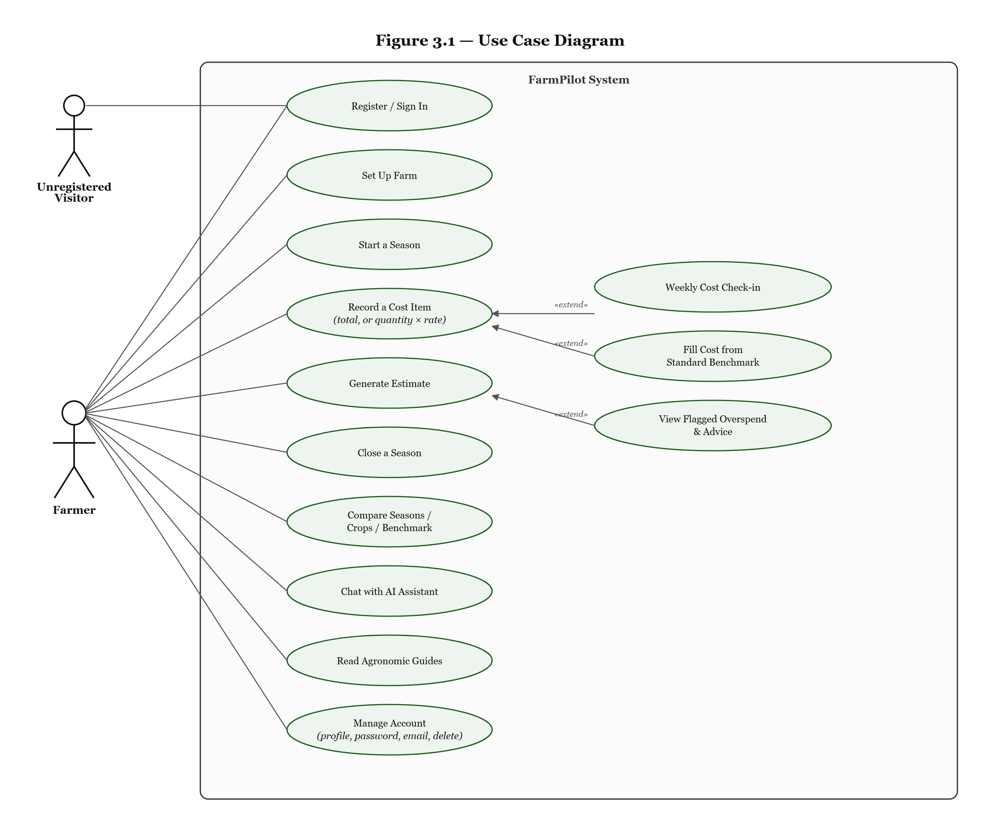
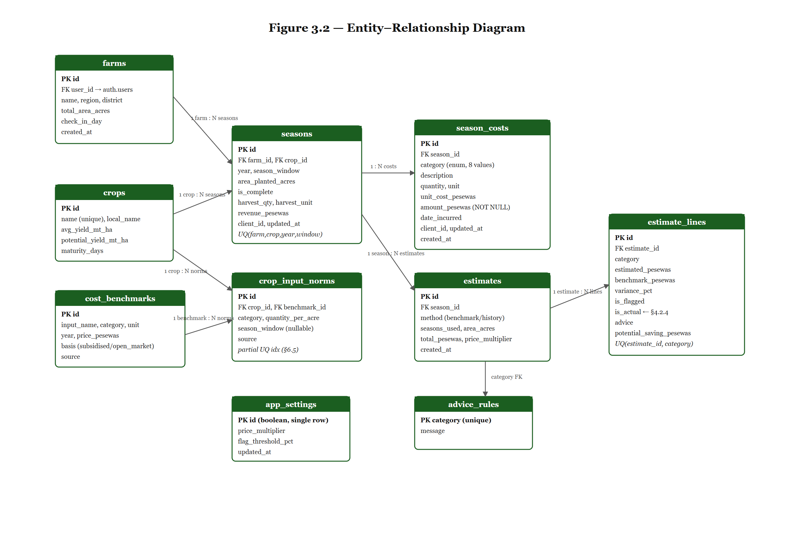
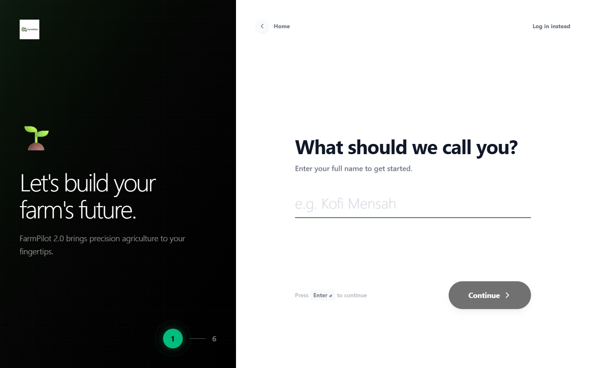
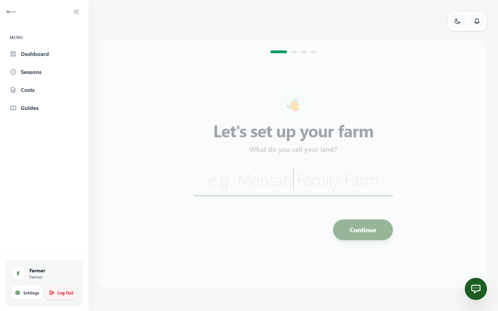
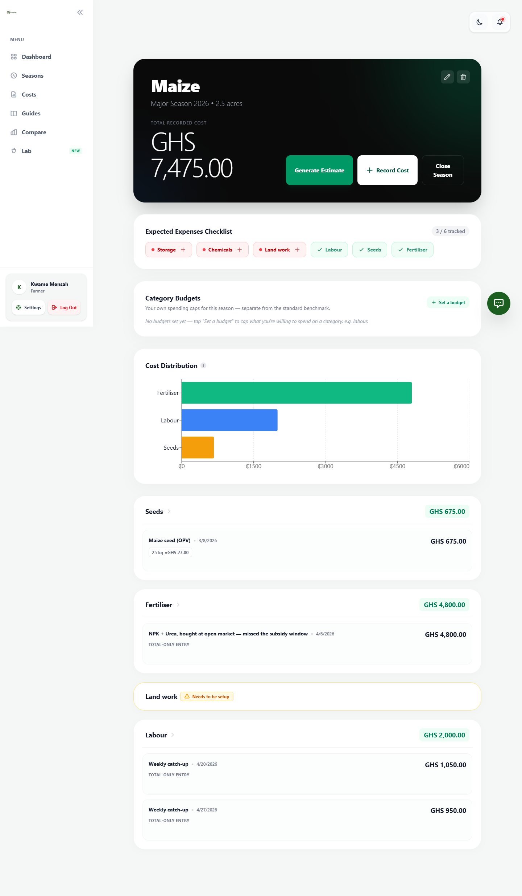
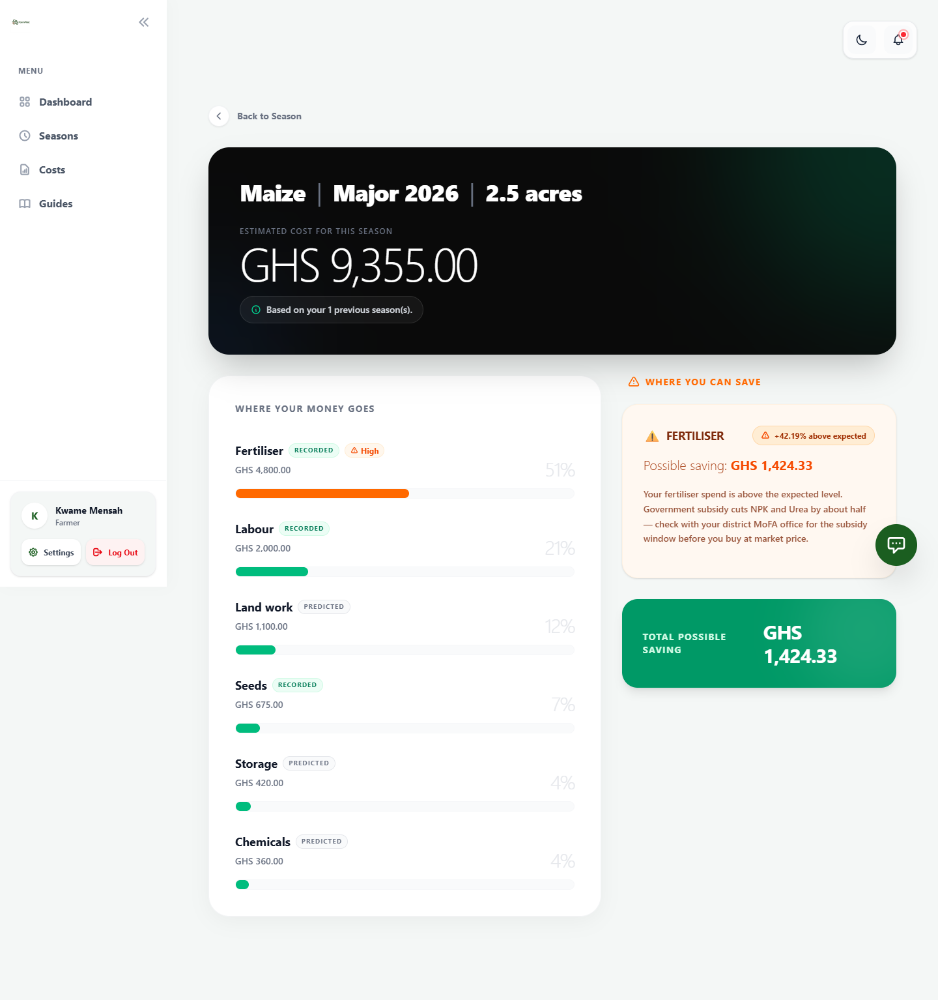
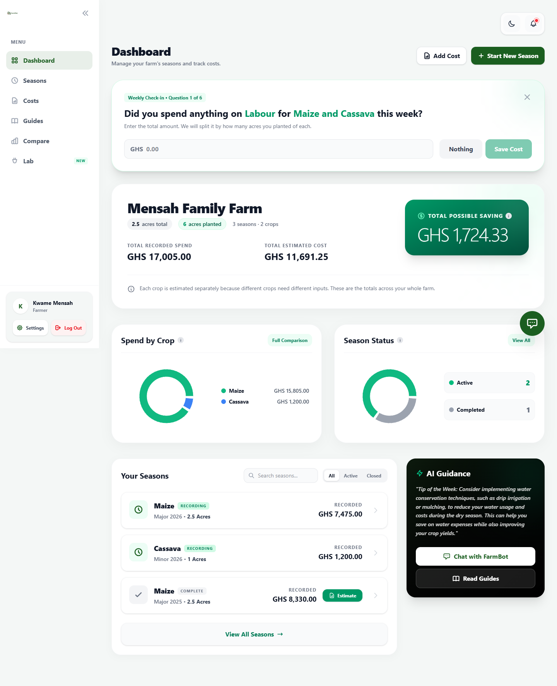
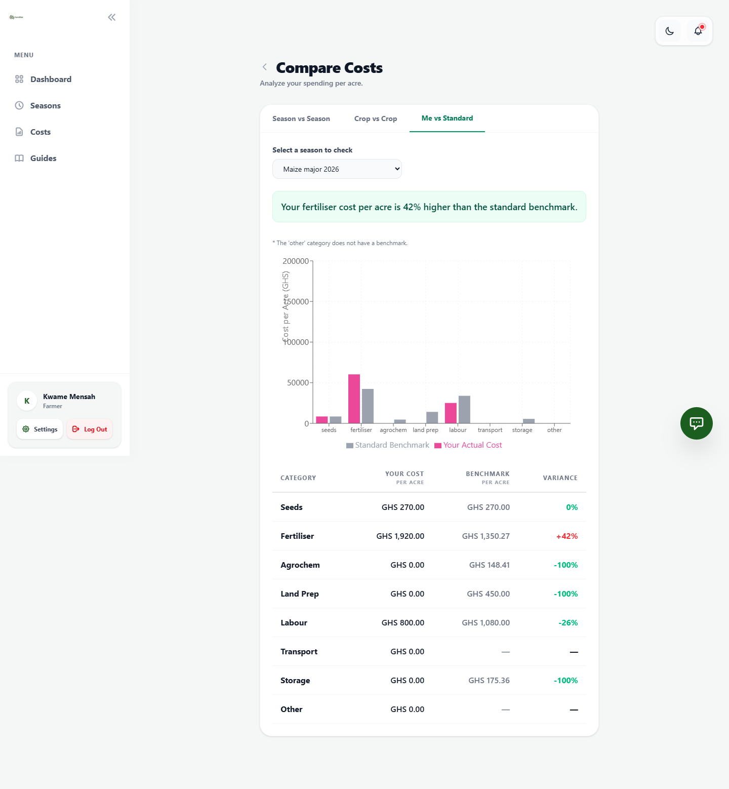
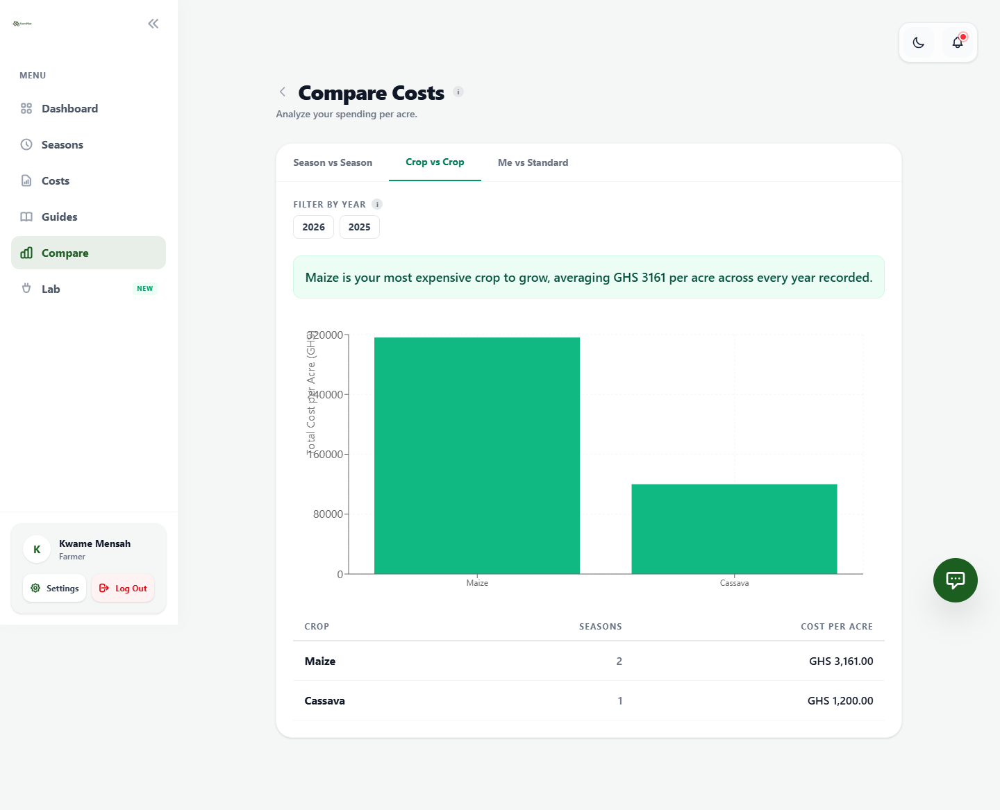
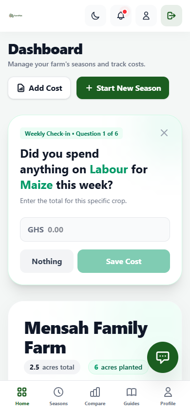

# FARMPILOT: A WEB-BASED FARM COST ESTIMATION AND OVERSPEND-DETECTION SYSTEM FOR SMALLHOLDER FARMERS IN GHANA

**A Mini Project Report Submitted to the Department of Computer Science, Kwame Nkrumah University of Science and Technology**

| | |
|---|---|
| **Course** | BSc Computer Science — Mini Project, Year 3 |
| **Academic Year** | 2025/2026 |
| **Supervisor** | *[Insert supervisor's name]* |
| **Date of Submission** | 3 September 2026 |
| **Repository** | https://github.com/itzSAD999/farmpilot (see Appendix A) |

**Team**

| Name | Student ID | Index Number |
|---|---|---|
| Osmond Abdul-Karim Woriwi | 21034402 | 8977223 |
| Aboagye Jeffery Ohene | 21013336 | 8978023 |
| Ayisha Abdullah | 20950630 | 3360622 |

---

## Abstract

FarmPilot is a web application that helps small-scale Ghanaian farmers answer two questions they otherwise cannot: what a farming season should cost, and where they are spending more than necessary. Farmers record their farm, seasons, and itemised costs; the system compares recorded spending, category by category, against an independent benchmark built from MoFA input-price data and per-acre application norms, then flags categories that exceed the benchmark by a configurable margin and attaches a specific, actionable suggestion. Where a farmer has no prior recorded history, the system still produces a usable estimate from the benchmark alone, solving the cold-start problem. The system was built with a React/TypeScript frontend and a Supabase (PostgreSQL) backend, with the estimation and flagging logic implemented as a database function so that authorisation and computation happen in one place. Testing against real recorded data confirmed the engine correctly distinguishes actual overspend from standard prediction. The result is a working, deployed tool that turns an unrecorded, unanswerable cost question into a specific, sourced, per-category answer.

**Keywords:** farm cost estimation, overspend detection, smallholder agriculture, Supabase, PostgreSQL row-level security, PL/pgSQL, benchmark comparison.

---

## Table of Contents

1. [Chapter One: Introduction](#chapter-one-introduction)
   1.1 Background
   1.2 Problem Statement
   1.3 Objectives
   1.4 Scope
   1.5 Significance
2. [Chapter Two: Literature Review](#chapter-two-literature-review)
   2.1 Related Concepts
   2.2 Related Works / Systems
3. [Chapter Three: Design and Methodology](#chapter-three-design-and-methodology)
   3.1 Methodology Used
   3.2 System Requirements
   3.3 Design Diagrams
4. [Chapter Four: Implementation and Results](#chapter-four-implementation-and-results)
   4.1 Tools Used
   4.2 How It Works
   4.3 Testing
5. [Chapter Five: Conclusion](#chapter-five-conclusion)
   5.1 Summary
   5.2 Limitations
   5.3 Recommendations
6. [References](#references)
7. [Appendix](#appendix)

---

## Chapter One: Introduction

### 1.1 Background

Smallholder farming is the backbone of Ghana's agricultural sector, and the majority of these farms are managed without any written financial record. A farmer growing maize, cassava, or vegetables typically knows, in general terms, that money went into seeds, fertiliser, land preparation, labour, transport, and storage over a season — but rarely knows the exact figure for each, and has no independent reference to judge whether any of those figures was reasonable. Decisions about what to plant, how much to spend, and when to buy inputs are made from memory and habit rather than from records.

This is not a literacy or willingness problem; it is a tooling problem. The applications that already serve Ghanaian agriculture — market-information platforms, aggregator and marketplace tools, advisory services — are built around an extension officer, a cooperative, or a buyer as the primary user, with the farmer as a beneficiary of information flowing through that intermediary. None of them are built to answer, directly and specifically, the two questions that determine whether a season is profitable: *what should this cost me*, and *where am I overspending*. FarmPilot was built to close that specific gap.

### 1.2 Statement of the Problem

A smallholder farmer cannot currently determine two things:

1. **What a season should cost.** Without a record of past seasons and without a reference figure, there is no way to plan or budget with any accuracy.
2. **Where spending is excessive.** Even a farmer who does track spending has nothing to measure it against — spending is only ever compared to nothing, or to a vague sense of "that felt like a lot."

The consequence is that the same avoidable overspend — most commonly buying fertiliser at open-market price when a subsidised window was available — repeats every season, unnoticed, because there is no mechanism that would ever surface it.

A closely related design problem, which shaped the whole system, is that **comparing a farmer only against his own past records cannot detect overspending at all**: if the only reference point is the farmer's own history, his figures will always equal his own baseline, and variance will always be zero. Detecting overspend requires a reference that is independent of the farmer being measured — a *benchmark* derived from how much of each input an acre of a given crop actually needs, at current market prices.

### 1.3 Objectives

The general objective of this project is to design and implement a web application that gives a smallholder farmer a per-category cost estimate for a season and identifies which categories are above the expected rate, with a specific suggestion for reducing each one.

The specific objectives are to:

1. Allow a farmer to register, record a farm, and record one or more growing seasons against it.
2. Allow a farmer to record costs per season, either as a single known total or as a quantity and a unit rate, grouped into a fixed set of categories (seeds, fertiliser, agrochemicals, land preparation, labour, transport, storage, other).
3. Maintain an independent benchmark data set — input prices and per-acre application norms, sourced from MoFA's *Agriculture in Ghana: Facts & Figures* — that is never derived from any individual farmer's own data.
4. Implement an estimation engine that produces a per-category cost estimate for a season, using the farmer's own historical average where it exists and the benchmark otherwise, and that compares whatever the farmer has *actually recorded this season* against the benchmark to flag overspending and compute a possible saving.
5. Attach a specific, actionable suggestion to every flagged category, rather than generic advice.
6. Enforce that a farmer can only ever read or write their own records, using database-level authorisation rather than trusting the client.
7. Provide supporting tools — a weekly check-in prompt, an AI assistant with real access to the farmer's own recorded and computed data, and a library of localisable agronomic guides — that make the core recording task easier to sustain.

### 1.4 Scope

The system covers: phone- or email-based farmer authentication; one farm and multiple seasons per farmer; itemised cost recording against a fixed category list; an estimation and overspend-flagging engine; a report screen; a dashboard with farm- and crop-level rollups; a season-vs-season, crop-vs-crop, and me-vs-benchmark comparison tool; a weekly cost check-in prompt; an AI chat assistant scoped to the farmer's own data; and an agronomic guide library.

Explicitly out of scope: yield or weather prediction; real-time market prices; farmer-to-farmer comparison; loan or credit features; support for multiple farms per user; and support for a field-officer/aggregator role that records on a farmer's behalf. These exclusions, and the reasoning behind each, are documented in full in the companion Product Requirements Document.

### 1.5 Significance

The project demonstrates, in a single working system, that a benchmark-driven approach can solve the cold-start problem that defeats a purely historical approach to farm-cost estimation — a farmer's very first season already produces a usable, sourced estimate. It also demonstrates that authorisation- and business-logic can be pushed into the database layer (row-level security and a PL/pgSQL estimation function) rather than re-implemented in application code, reducing the surface area for the exact class of bug — an authorisation check that is present in one code path and missing in another — that is common when the same rule is enforced in multiple places. Beyond the academic exercise, the system is directly usable: a real farmer, in minutes, can get an answer to a question they previously had no way of answering.

---

## Chapter Two: Literature Review

### 2.1 Related Concepts

**Farm budgeting and cost-benchmarking.** Agricultural extension literature has long used *per-acre input norms* — the quantity of a given input a hectare or acre of a given crop requires — multiplied by the current unit price, as the standard way to construct an expected cost for a season before it is planted. Ghana's Ministry of Food and Agriculture publishes exactly this kind of data in its periodic *Agriculture in Ghana: Facts & Figures* reports, covering national average yields, benchmark input prices, and the subsidised-versus-open-market price gap for fertiliser. FarmPilot's benchmark layer (Chapter Three) is a direct digitisation of this established extension-planning method, made comparable at the level of an individual recorded cost rather than a printed table.

**Row-level security as an authorisation model.** Traditional web applications enforce "a user may only see their own data" in application code — a middleware check, a `WHERE user_id = ?` clause added by hand to every query. PostgreSQL's row-level security (RLS) moves that rule into the database itself: a policy attached to a table is evaluated by the database on every read and write, regardless of which code path issued the query. This is the authorisation model FarmPilot uses throughout (§3.2, §4.2), and it is increasingly the default recommendation for applications, like this one, that talk to the database through an auto-generated REST layer (PostgREST, via Supabase) rather than a hand-written API server.

**Database-resident business logic.** Placing calculation logic inside the database, as a stored function, rather than in an intermediate application server is a deliberate architectural trade-off. It keeps computation next to the data it reads (avoiding transferring every cost row to a separate service and back), lets the same row-level security policies protect the calculation as protect direct table access, and removes an entire deployment and its associated cross-service authentication. The cost is that PL/pgSQL is harder to unit-test in isolation than an equivalent function in a general-purpose language — a trade-off this project accepted and documents explicitly (§4.1, §5.2).

### 2.2 Related Works / Systems

Four categories of existing tool were reviewed against the two questions FarmPilot targets — *what should this cost* and *where am I overspending*.

**1. Esoko.** Esoko is a Ghana-founded market-information platform that distributes commodity prices and agronomic tips to farmers over SMS and a web dashboard, aimed primarily at helping farmers time their sales. It answers "what is the market price today," not "what should my input costs be" or "am I overspending on any category" — cost estimation and per-category benchmarking are outside its scope.

**2. AgroCenta.** AgroCenta is a Ghanaian agri-tech platform connecting smallholder farmers to structured markets and, more recently, to input financing. Its focus is aggregation and market access on the sell side; it does not offer a farmer-facing tool for recording or benchmarking input spending on the buy side.

**3. Farmerline (Mergdata).** Farmerline's Mergdata platform delivers voice- and SMS-based agronomic advisory content to farmers, often through partner organisations, and is explicitly built for low-literacy access. It is the closest of the three in spirit — advisory content reaching the farmer directly — but the advice is agronomic (when to plant, how to control a pest) rather than financial, and it is not built around the farmer's own itemised cost records.

**4. General-purpose expense-tracking apps.** Consumer expense trackers (the kind used for personal budgeting) can record a farmer's spending by category, and some produce a simple total. What none of them provide is the benchmark: a category total with no external reference point cannot answer "is this too much," only "here is what I spent" — precisely the limitation identified as the core design problem in §1.2.

### 2.3 Comparative Summary

| Criterion | Esoko | AgroCenta | Farmerline / Mergdata | Generic expense trackers | **FarmPilot** |
|---|---|---|---|---|---|
| Records itemised costs | No | No | No | Yes | **Yes** |
| Compares against an external benchmark | No (market price only) | No | No | No | **Yes** |
| Flags specific overspend with a saving figure | No | No | No | No | **Yes** |
| Actionable, specific advice per category | No | No | Yes (agronomic, not financial) | No | **Yes** |

### 2.4 Gap Identified

None of the reviewed systems combine itemised, category-level cost recording with an *independent* benchmark comparison that works from a farmer's very first season. This is the gap FarmPilot addresses, and the reason the benchmark layer — not the recording form, which is comparatively straightforward — is the central design problem of the project (§1.2, §3.1).

---

## Chapter Three: Design and Methodology

### 3.1 Methodology Used

The system was built using an **iterative, feature-driven approach** structured around vertical slices — authentication, then farm and season recording, then cost capture, then the estimation engine, then the dashboard and comparison tooling — with each slice taken from database schema through to a working screen before moving to the next, rather than completing the entire schema first and the entire UI second. This suited a three-person team on a compressed timeline better than a strict waterfall process would have, because it surfaced integration problems (for example, a mismatch between what the estimation function returned and what the report screen expected) early, while the relevant code was still fresh, instead of at a single integration phase at the end.

A schema-first discipline was kept within that iterative process: the database schema for a given slice was agreed and frozen before the corresponding UI work began, and Git branch-per-developer with pull-request review into `main` was used throughout, so that the generated TypeScript types (§4.1) served as a compile-time contract between the database and every frontend developer.

### 3.2 System Requirements

**Functional requirements** (condensed from the full Product Requirements Document — see Appendix A for the complete list):

- A user can register and sign in with a phone number or an email address.
- A user records exactly one farm (name, district, region, total area) before any other screen is reachable.
- A user creates a season (crop, year, growing window, area planted) against their farm.
- A user records cost items against a season, in one of eight fixed categories, either as a flat total or as a quantity multiplied by a unit rate.
- A user can generate an estimate for a season; the system determines whether to use the farmer's own historical average or the standard benchmark, produces a per-category figure, and flags any category where *actually recorded* spending exceeds the benchmark by more than a configurable threshold (default 30%).
- Every flagged category is shown with its variance percentage, a possible saving in cedis, and one specific, actionable suggestion.
- A user can view a farm-level and crop-level rollup dashboard, and compare seasons, crops, or their own spending against the benchmark directly.

**Non-functional requirements:**

- All monetary values are stored and computed as integer pesewas (1/100 of a cedi); no floating-point arithmetic is used at any point, to eliminate rounding drift.
- A user may only ever read or write their own farm, season, cost, and estimate records — enforced at the database layer, not only in application code.
- The interface must be usable on a 360px-wide mobile screen, since the primary user is expected to be on a phone in the field.
- Estimate generation must complete in under two seconds for a season with fifty recorded cost items.
- The schema and reference data must be reproducible from committed migration files with no manual step.

### 3.3 Design Diagrams

#### 3.3.1 Use Case Diagram



The **Farmer** is the only actor with write access to owned data; reference data (crops, benchmark prices, application norms, advice text) is read-only to every signed-in user and is never writable through the application (§4.2, §8.2 of the SDD). The three use cases on the right are `«extend»`s of a primary use case rather than actions a farmer chooses directly: *Weekly Cost Check-in* and *Fill Cost from Standard Benchmark* both extend *Record a Cost Item* — all three write to the same underlying record, so a cost logged through either shortcut is indistinguishable from one logged through the normal form once saved — and *View Flagged Overspend & Advice* extends *Generate Estimate*, since a flag is never viewed except as part of a generated report.

**Use case descriptions**

| ID | Use Case | Actor(s) | Description |
|---|---|---|---|
| UC-1 | Register / Sign In | Farmer, Unregistered Visitor | Create an account (phone or email) or sign in to an existing one |
| UC-2 | Set Up Farm | Farmer | Record farm name, region, district, total acreage, and a preferred weekly check-in day; required once before any other screen is reachable |
| UC-3 | Start a Season | Farmer | Record a season: crop, year, growing window, and area planted |
| UC-4 | Record a Cost Item | Farmer | Log a cost against a season's fixed category list, as a flat total or a quantity × rate |
| UC-4a | Weekly Cost Check-in *(extends UC-4)* | Farmer | Standing prompt that asks, per expected category across all active seasons, "did you spend anything this week?" — writes an ordinary cost item on answer |
| UC-4b | Fill Cost from Standard Benchmark *(extends UC-4)* | Farmer | Where a category's cost is unknown, fill the amount from the benchmark rate, scaled to the season's acreage, instead of guessing |
| UC-5 | Generate Estimate | Farmer | Run the estimation engine for a season: predicts unrecorded categories from history or benchmark, compares recorded categories against the benchmark |
| UC-5a | View Flagged Overspend & Advice *(extends UC-5)* | Farmer | See which categories exceeded the benchmark by more than the threshold, the possible saving, and a specific suggestion |
| UC-6 | Close a Season | Farmer | Mark a season complete with harvest quantity, unit, and optional revenue; makes it eligible as history for future estimates |
| UC-7 | Compare Seasons / Crops / Benchmark | Farmer | Season-vs-season, crop-vs-crop, or "me vs standard" per-acre comparisons |
| UC-8 | Chat with AI Assistant | Farmer | Ask FarmBot for advice; it has live access to the farmer's own farm, seasons, costs, and computed overspend flags |
| UC-9 | Read Agronomic Guides | Farmer | Browse the guide library; optionally request an AI-personalised version for the farmer's own crop and farm size |
| UC-10 | Manage Account | Farmer | Edit profile/farm details, change password, link an email to a phone account, or permanently delete the account and all farm data |

#### 3.3.2 Entity–Relationship Diagram



`auth.users` (Supabase's built-in identity table, one row per registered farmer) sits above `farms` and is omitted from the diagram for space — every `farms.user_id` is a foreign key into it, cascading on delete. `is_actual` on `estimate_lines` distinguishes a category the farmer has actually recorded this season from one still showing a prediction (§4.2.3) — added during implementation once testing revealed the original design's flagging logic needed it (§4.2.4).

The full relationship cardinalities, ON DELETE behaviour, and constraint list are documented in the companion System Design Document, §6.

---

## Chapter Four: Implementation and Results

### 4.1 Tools Used

| Concern | Tool / Technology |
|---|---|
| UI framework | React 19 with TypeScript |
| Build tool | Vite |
| Styling | Tailwind CSS v4 |
| Forms & validation | React Hook Form + Zod |
| Server-state caching | TanStack Query |
| Charts | Recharts |
| Backend / database | Supabase (managed PostgreSQL 17) |
| Auth | Supabase Auth (GoTrue) |
| API layer | PostgREST, auto-generated from the schema — no hand-written endpoints |
| Business logic | PL/pgSQL functions (`generate_estimate`, `quick_fill_costs`, `get_category_benchmark_pesewas`) |
| Offline support | `vite-plugin-pwa` + IndexedDB, for cost entry in the field with no signal |
| AI assistant | Claude via OpenRouter, with a system prompt built from the farmer's own live farm, season, cost, and overspend-flag data |
| Type safety | TypeScript types generated directly from the live database schema via the Supabase CLI, regenerated after every migration |
| Version control | Git / GitHub, branch-per-developer, pull request into `main` |
| Hosting | Vercel (frontend), Supabase (database) |

The database schema, seed data, and every subsequent change are committed as numbered SQL migration files under `supabase/migrations/`, so the system is reproducible from source with no manual step (Appendix A).

### 4.2 How It Works

#### 4.2.1 Onboarding

A new user signs up with a phone number or an email address (Figure 4.1), then completes a short farm-setup flow — name, region, district, total acreage, and a preferred weekly check-in day (Figure 4.2) — before the dashboard becomes reachable.

*Figure 4.1 — Sign-up.*


*Figure 4.2 — Farm setup.*


#### 4.2.2 Recording seasons and costs

A season is created against a crop, year, and growing window; costs are then recorded against it either as a flat total or as a quantity times a unit rate. The season screen (Figure 4.3) shows an "Expected Expenses Checklist" driven by the crop's own input norms where they exist, and a running total and cost-distribution chart that update immediately as costs are added.

*Figure 4.3 — Season detail, with costs recorded and the checklist reflecting what has and has not been logged.*


Where a farmer does not know a category's cost, the add-cost form can fill it with the standard benchmark rate, scaled to the season's planted acreage, rather than leaving them to guess or leave it blank.

A farmer who already has exact figures for a crop from previous years is not limited to the live, week-by-week recording flow to get them into the system: at season creation, after picking a crop, they can optionally back-fill up to three previous years — year, area planted, and a per-category total each — which are saved directly as already-closed seasons. This has no separate code path in the estimation engine: a back-filled season is an ordinary completed season, so `generate_estimate()` (§4.2.3) picks it up as history exactly as if it had been recorded live, letting a returning farmer skip the benchmark entirely from their very first season in the app.

#### 4.2.3 The estimation engine

Clicking *Generate Estimate* calls the `generate_estimate(season_id)` PL/pgSQL function. For each cost category, the function:

1. Determines whether the farm has a prior *completed* season of the same crop. If so, the farmer's own historical per-acre average is used as the prediction basis (`method = 'history'`); otherwise the standard MoFA-derived benchmark rate is used (`method = 'benchmark'`).
2. Checks whether the farmer has *already recorded* a cost in that category for the season being estimated. If they have, that recorded figure — not the prediction — becomes the category's `estimated_pesewas`, and the category is marked `is_actual = true`.
3. For a category marked `is_actual`, compares the recorded figure against the fixed benchmark rate for that category. Where the variance exceeds the configured threshold (default 30%), the category is flagged, a possible saving is computed, and a category-specific suggestion is attached from `advice_rules`.

The result (Figure 4.4) shows the season's estimated total, a per-category breakdown labelled "Recorded" or "Predicted" depending on `is_actual`, and — for anything flagged — the exact variance, the possible saving in cedis, and the suggested fix. In the demonstration account (Appendix D), the farmer has one completed prior season, so the method is `history` ("Based on your 1 previous season(s)") — the three categories not yet recorded this season (land work, storage, chemicals) are predicted from the farmer's own past average, while fertiliser and labour, both already recorded, are compared directly against the fixed benchmark: fertiliser was bought at open-market price and is flagged 42% over, with a possible saving of GHS 1,424.33 and the subsidy-window suggestion; labour came in 26% under benchmark and is correctly left unflagged.

*Figure 4.4 — Estimate report on the demonstration account. Fertiliser recorded 42% above the benchmark is flagged with a specific, sourced suggestion; labour is recorded but under benchmark and not flagged; unrecorded categories show as "Predicted" from the farmer's own history.*


#### 4.2.4 A design correction found during implementation

The first implementation of `generate_estimate` computed the "estimated" figure and the "benchmark" figure it was compared against from the same source whenever no prior history existed — so, for any farmer's first season of a crop, the two were identical by construction, variance was always 0%, and no category could ever be flagged, regardless of what was actually recorded. This was caught by testing the engine directly against known figures (§4.3) rather than only by inspecting the UI, and was corrected by adding the "already recorded this season" check described in step 2 above, plus a schema column (`is_actual`) to record which case applied. This correction — going from comparing a prediction against itself to comparing a farmer's real recorded spending against the benchmark — is the single most consequential change made after the initial implementation, and is documented in full, including the exact before/after test output, in the project's `FarmPilot_SDD.md`, §9.2.

#### 4.2.5 Dashboard and comparison tooling

The dashboard (Figure 4.5) rolls estimates and recorded totals up to farm and crop level, surfaces the weekly check-in prompt, and gives a quick "Add Cost" action that does not require navigating into a specific season first. The demonstration farm carries two crops (Maize and Cassava) across three seasons — one completed, two active — so the rollup, the "Spend by Crop" chart, and the season list all show real, varied data rather than a single empty-state example.

*Figure 4.5 — Dashboard, farm-level rollup across two crops and three seasons.*


A separate comparison screen lets a farmer compare their own recorded per-acre spend against the benchmark directly (Figure 4.6), independent of whether they have generated a formal estimate, or compare crops against each other where more than one is being grown (Figure 4.7). All ten seeded crops, Cassava included, now carry indicative per-acre norms (§3.3.2), so every crop is usable in the benchmark tab as well as the crop-vs-crop and season-vs-season comparisons, which are driven entirely by recorded costs regardless of benchmark coverage.

*Figure 4.6 — "Me vs Standard" comparison, corroborating the same fertiliser overspend shown in Figure 4.4.*


*Figure 4.7 — Crop vs Crop comparison, Maize against Cassava on cost per acre.*


#### 4.2.6 Mobile

Every screen is usable at 360px width (Figure 4.8); cost entry, the weekly check-in, and the dashboard were the primary design targets for the mobile layout, since a farmer is expected to be standing in a field with a phone rather than at a desk.

*Figure 4.8 — Mobile dashboard.*


#### 4.2.7 Cost Lab, Category Budgets, and exporting a report

Three further tools sit alongside the core recording-and-estimating flow, each addressing a distinct question a farmer might have.

**Cost Lab** (`/lab`) answers "what would this cost, hypothetically" without touching a real season. A farmer picks a crop, a season window, and an acreage; every category is seeded from the same benchmark math `generate_estimate()` itself uses — a new database function, `get_crop_benchmark_breakdown()`, computes it directly from `crop_input_norms` and `cost_benchmarks` given a crop and acreage rather than requiring an existing `seasons` row. The farmer can then drag any category to see the scenario's total, per-acre cost, and percentage against the standard rate — entirely client-side, so nothing is written to the database until the farmer actually starts a real season.

**Category Budgets** answer a different question: not "is this above the national-average benchmark," but "is this above what *I* am willing to spend this season." A farmer can cap any category for an active season (e.g. "no more than GHS 500 on labour"); the season page shows a progress bar per category, and the cost-entry form itself warns, before the cost is saved, if the amount being entered would push that category over its cap. This is deliberately independent of the benchmark comparison — a category can be within the MoFA-derived benchmark and still over a farmer's own budget, or the reverse.

**Exporting a report.** Both the Estimate Report and the farm-wide Costs page carry a "Download PDF" action, using the browser's native print-to-PDF rather than a client-side PDF library — the report screen already needed a clean, chart-inclusive print layout for a farmer to hand to a lender or cooperative, so the browser's own "Save as PDF" destination was the more reliable route than a separately-maintained PDF renderer.

### 4.3 Testing

Testing combined direct database-level verification of the estimation engine (the part of the system with the least visible surface area, and the part most likely to be silently wrong) with functional testing of the recording and reporting flows end to end.

| # | Test | Method | Expected result | Actual result |
|---|---|---|---|---|
| T1 | Fresh estimate, no history, nothing recorded | Generate an estimate for a brand-new season with zero cost items but a crop that has benchmark norms | Estimate produced from benchmark alone; every line `is_actual = false` | Pass |
| T2 | Fresh estimate, a category recorded 60% over benchmark | Record one cost 60% above the known benchmark rate, generate an estimate | That category flagged, `variance_pct ≈ 60`, non-null advice; before the fix in §4.2.4, this produced `variance_pct = 0`, `is_flagged = false` | Pass (post-fix) |
| T3 | Recorded category under benchmark | Record a cost below the benchmark rate | Category shown as "Recorded," not flagged | Pass |
| T4 | Category never recorded | Leave a category with no cost item | Shown as "Predicted," never flagged regardless of its predicted value | Pass |
| T5 | History method | Complete a prior season of the same crop with recorded costs, then estimate a new season | `method = 'history'`; prediction lines for unrecorded categories use the farmer's own average, not the fixed benchmark | Pass |
| T6 | Crop with no benchmark norms, nothing recorded | Generate an estimate for a crop with zero `crop_input_norms` rows and zero recorded costs | Interactive checklist shown instead of an empty report; falls back to the general essential-categories list | Pass |
| T7 | Duplicate-row regression | Query `crop_input_norms` for `(crop_id, benchmark_id, season_window)` uniqueness | Exactly one row per combination | Pass (a pre-existing defect that had produced five duplicate rows per Maize input, inflating every benchmark figure 5×, was found and fixed during this testing pass — see `FarmPilot_SDD.md` §6.5) |
| T8 | Row-level security | Sign in as two different accounts; attempt to read the other account's farm, seasons, and costs | Zero rows returned, no error revealing existence | Pass |
| T9 | Monetary rounding | Sum a season's recorded costs both client-side and via the database view | Totals match exactly; no floating-point drift | Pass |
| T10 | Mobile layout | Load the dashboard, farm-setup, season, and report screens at 360–390px width | No horizontal scroll; no overlapping fixed elements | Pass (a bottom-anchored chat button and PWA-install prompt were found overlapping the mobile navigation bar and corrected during this pass) |
| T11 | Offline cost entry | Record a cost item with the network disabled, then reconnect | Entry queues locally, flushes automatically on reconnect, no duplicate created on a retried flush | Pass |
| T12 | Full first-time walkthrough | Sign up → farm setup → new season → six cost items → generate estimate → report | Completed without assistance; report shows at least one flagged category with advice on realistic demonstration data | Pass |

Tests T2, T6, T7, and T10 each led directly to a correction in the implementation rather than only confirming existing behaviour — a reflection of testing being carried out throughout implementation rather than only after it (§3.1).

---

## Chapter Five: Conclusion

### 5.1 Summary

FarmPilot was built to answer two questions a smallholder farmer cannot currently answer from any existing tool: what a season should cost, and where they are spending more than they need to. The system achieves this by pairing a farmer's own itemised, category-level cost records with an independent benchmark built from published agricultural price and application-rate data, and by comparing the two at the point a cost is actually recorded rather than only at the point an abstract prediction is made. Every functional objective set out in §1.3 was implemented and verified: registration and farm/season recording, itemised cost capture along two entry paths, the benchmark-and-history estimation engine, overspend flagging with specific per-category advice, database-enforced data isolation, and the supporting tools — weekly check-in, AI assistant, and comparison views — that make the core recording habit easier to sustain.

### 5.2 Limitations

Two limitations identified during an earlier review of this report — benchmark coverage limited to one crop, and the weekly check-in splitting a shared cost evenly rather than by planted acreage — were corrected before submission and are recorded as resolved in the Development Log (Appendix E) rather than listed here as outstanding. What remains:

- **Benchmark source data is nationally averaged and dated (2018 MoFA figures, inflated by a configurable multiplier).** It does not vary by region, and does not reflect farm-scale differences — figures partly informed by larger commercial-scale records may understate what is realistic for a true smallholder plot, which is stated plainly in the report rather than presented as precise (ADR-011, Appendix E).
- **The newly added norms for the nine non-maize crops (§3.3.2) are indicative, not field-verified** — seeded from general smallholder agronomic knowledge, in the same "INDICATIVE — verify with CSIR-CRI" status the original maize norms already carried, and still need checking against extension records before being presented as sourced fact.
- **Business logic implemented in PL/pgSQL is harder to unit-test in isolation** than the same logic in a general-purpose language; verification relied on integration-style tests run directly against the live database (§4.3) rather than a conventional unit-test suite.
- **Phone-based identity is not SMS-verified.** A phone number functions as an account identifier, not a communication channel, in the current implementation.
- **No support for multiple farms per user or for a field-officer/aggregator role**, both of which were identified during design as valuable but out of scope for the project window.

### 5.3 Recommendations

- Verify the indicative application-rate norms for all ten crops against CSIR-CRI extension recommendations or real farm records, replacing the "INDICATIVE" source label with a field-verified one crop by crop.
- Source region-specific benchmark data where available, to remove the single-national-average approximation.
- Introduce a lightweight aggregator/field-officer role, since farmer-side data entry is a known adoption barrier in comparable systems (§2.2), and the schema was designed not to preclude this extension.
- Add automated regression tests around the estimation engine specifically (§4.3, T2 and T7), since both defects found during this project were in logic that had no earlier automated check and were caught only by deliberate, manual, database-level testing.

---

## References

1. Ministry of Food and Agriculture (Ghana), *Agriculture in Ghana: Facts and Figures*, Statistics, Research and Information Directorate (SRID), 2018 edition — source of national average crop yields (Table 4.6), benchmark input prices (Table 7.3), and fertiliser subsidy price structure (Table 7.5) used throughout the benchmark layer (§3.3.2, §4.2.3).
2. Esoko Networks — market information and agronomic SMS platform. *[Insert full citation / URL — not supplied by the team; add before submission.]*
3. AgroCenta — farmer aggregation and market-access platform. Available at: https://agrocenta.com/ (Accessed: *[insert access date]*).
4. Farmerline — Mergdata advisory platform. Available at: https://farmerline.co/ (Accessed: *[insert access date]*).
5. Supabase Inc., *Supabase Documentation* — Auth, Row Level Security, and PostgREST reference material used throughout the implementation. Available at: https://supabase.com/docs (Accessed: *[insert access date]*).
6. PostgreSQL Global Development Group, *PostgreSQL 17 Documentation*, chapters on Row Security Policies and PL/pgSQL. *[Insert URL and access date.]*

> **Note to the team before submission:** the access dates above and the Esoko and PostgreSQL URLs still need to be filled in, and every entry's exact citation format must be checked against the department's required style (APA/IEEE) before this report is submitted.

---

## Appendix

### Appendix A — Source Code

Full source code is maintained in the project's Git repository at
**https://github.com/itzSAD999/farmpilot**, structured as described in
`FarmPilot_SDD.md` §5.1 and §16.3. Key implementation artefacts referenced
in this report:

- `supabase/migrations/001_schema.sql` — base schema, RLS policies, and the original estimation engine.
- `supabase/migrations/010_estimate_actual_vs_benchmark.sql` — the actual-vs-benchmark correction described in §4.2.4.
- `supabase/migrations/012_fix_crop_input_norms_duplicates.sql` — the duplicate-row fix described in T7 (§4.3).
- `src/pages/EstimateReport.tsx` — the report screen (Figure 4.4).
- `src/hooks/useAuth.tsx`, `src/lib/supabase.ts` — authentication and session handling.

### Appendix B — Sample Screenshots

See Figures 4.1–4.8 in Chapter Four, and the full-resolution originals under `docs/screenshots/` in the repository:

| File | Shows |
|---|---|
| `01_landing.png` | Public landing page |
| `02_signup.png` | Sign-up flow |
| `03_farm_setup.png` | Farm setup |
| `05_dashboard_populated.png` | Dashboard with real data (demo account) |
| `06_season_detail.png` | Season detail, costs recorded (demo account) |
| `07_estimate_report.png` | Estimate report with a flagged category (demo account) |
| `08_compare_benchmark.png` | "Me vs Standard" comparison (demo account) |
| `09_mobile_dashboard.png` | Mobile dashboard, 390px width (demo account) |
| `10_signin.png` | Sign-in screen |
| `11_seasons_list.png` | Seasons list, all three demo seasons |
| `12_compare_crops.png` | Crop vs Crop comparison (demo account) |

### Appendix C — User Manual (Quick Start)

1. Open the application and select **Sign Up**. Choose phone or email, enter a full name and password.
2. Complete farm setup: farm name, region, district, total acreage, and a preferred weekly check-in day.
3. From the dashboard, select **Start New Season**: choose a crop, year, growing window, and area planted.
4. Open the season and select **Record Cost** (or **Add Cost** from the dashboard). Choose a category, then either enter a known total or a quantity and rate. If the exact figure is unknown, use the benchmark-fill option where available.
5. Once at least one cost is recorded, select **Generate Estimate** to see the season's estimated total, the category breakdown, and any flagged overspend with its suggested fix.
6. Use **Compare** to view season-vs-season, crop-vs-crop, or "me vs standard" comparisons at any time.
7. Answer the weekly check-in prompt on the dashboard as it appears, to keep records current with minimal effort.

### Appendix D — Demonstration Account

A permanent, fully-populated demo account is seeded on the live database for presentations, marking, and supervisor review, so the system can be evaluated without first stepping through empty-state onboarding.

| | |
|---|---|
| **URL** | https://farmpilot-chi.vercel.app/signin |
| **Email** | `kwame.mensah@farmpilot.demo` |
| **Password** | `FarmPilotDemo2026!` |

The account belongs to "Kwame Mensah," the primary persona already described in the companion PRD (§4.1) — a 2.5-acre farm in Ejisu, Ashanti Region — and is seeded with data chosen specifically to exercise every feature discussed in this report in one login:

- A **completed** 2025 season (full cost history, so the 2026 season below genuinely uses `method = 'history'`, not just the benchmark).
- An **active** 2026 Maize season with a deliberate fertiliser overspend (flagged, with a real possible-saving figure and advice — Figure 4.4), a category recorded comfortably under benchmark (labour, correctly not flagged), and several categories left unrecorded to show the "Predicted" state.
- A **second crop** (Cassava), populating the crop-vs-crop and season-vs-season comparisons — now with its own real benchmark norms too (§3.3.2, §5.2), so it demonstrates the history/benchmark engine a second time on an independent crop rather than the essentials-checklist fallback.
- Costs entered through both recording paths (flat total and quantity × rate) and tagged consistently with what the Weekly Check-in feature itself writes.

The account is fully reproducible from `supabase/demo_seed.sql` in the repository — the script is idempotent (it deletes and recreates the account each time it is run), documents the exact rationale for every seeded figure in its header comments, and can be re-applied at any point with:

```bash
npx supabase db query --linked -f supabase/demo_seed.sql
```

### Appendix E — Development Log, Issue Register & Testing Record

A full account of the project treated as a real, shipped system rather
than only a final snapshot: the six-week Python-based proposal versus
what was actually built and why, a stage-by-stage development timeline,
an index into all twelve architecture decisions, a twenty-seven-item issue
register from a full post-build hardening pass (each with root cause, fix,
and live verification evidence), the complete testing record behind
Chapter Four's summary table, and the outstanding backlog. Kept as a
separate document, `FarmPilot_Development_Log.md`, so this report stays
readable as a report rather than a defect tracker.

---

*End of report.*
